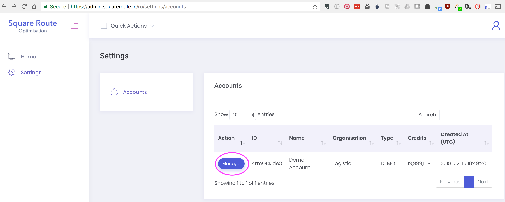
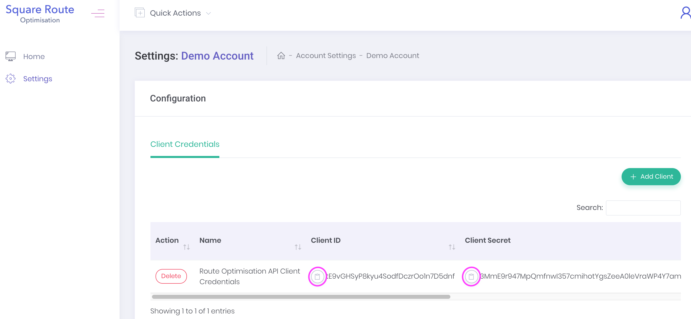

# Squareroute Getting Started

The below quickstart shows you how to make a curl request using bash.

* Clone this repository
```bash
git clone https://github.com/logistio/squareroute-getting-started.git
```
```bash
cd squareroute-getting-started
```

* Log into ```https://admin.squareroute.io```
* Copy your credentials from the dashboard on ```https://admin.squareroute.io/ro/settings/accounts```



* Paste in your respective values 
```bash
clientID= # e.g. tE9vGHSyP8kyu4SodfDczrOo1n7D5dnf
```
```bash
clientSecret= # e.g. 3MmE9r947MpQmfnwI357cmihotYgsZeeA0leVraWP4Y7amvIlYpkKVWRolZkVz55lRcBcGVPNZ36SdqfeXeEwdlhj2PWgQnzIHeHii2wTsAd2lbB53txNZBoPKZ5545i
```

* Select a file e.g. request4 for a 4*4 matrix (16 credits, takes approximately 5 seconds), or request1000 for a 1000*1000 matrix (1,000,000 credits, takes 1-2 minutes, 30 MB file size for finished matrix). 
```bash
data=requests/request500.json
```

* Submit the request and capture the response (this uses the sample data with 4 stops in result.json, you can modify this with your own data)
```bash
response=$(curl -X POST \
  https://api.squareroute.io/api/v1/ro/calculate \
  -H "accept: application/json" \
  -H "content-type: application/json" \
  -H "client-id: $clientID" \
  -H "client-secret: $clientSecret" \
  -d @$data); echo $response
```
* The response will look like:
```bash
{
    "data": {
        "task_id": "eLWGVwAvoa",
        "credit_cost": 25
    }
}
```

* Capture the taskID variable - requires jq (```brew install jq```)
```bash
taskID=$(jq -r '.data.task_id' <<< "$response")
```

* Periodically poll for the status of the job
```bash
curl -X GET \
  https://api.squareroute.io/api/v1/ro/task/$taskID/status \
  -H "accept: application/json" \
  -H "client-id: $clientID" \
  -H "client-secret: $clientSecret"
```

When the job status changes to ```FINISHED``` like below, proceed to retrieve the result. For small jobs this will be a couple of seconds.

```json
{
    "data": {
        "task_id": "ABCD1234",
        "status": "FINISHED",
        "updated_at": "2018-02-28 10:31:55"
    }
}
```
* Retrieve the result and save it to result.json
```bash
curl -X GET \
  https://api.squareroute.io/api/v1/ro/task/$taskID/result \
  -H "accept: application/json" \
  -H "client-id: $clientID" \
  -H "client-secret: $clientSecret" \
  -o responses/result.json
```

* View the output
```bash
cat result.json | jq
```

* The result should look similar to the below.

```json
{
    "data": {
        "task_id": "Zrn7z0Gvz2",
        "ro_result": {
            "about": {
                "api_version_code": 1,
                "api_version_name": "v0.1.0",
                "matrix_engine": "graphite-v1",
                "attributions": [
                    "OpenStreetMap contributors"
                ]
            },
            "location_ids": [
                "73-dame-street",
                "24-wexford-street",
                "82-parnell-street",
                "15-ormond-quay-upper",
                "8-leeson-st-lower"
            ],
            "cost_matrix": {
                "weights": [
                    [
                        0,
                        211377.92024906856,
                        379860.6258050474,
                        147907.0332547986,
                        467322.5400465949
                    ],
                    [
                        211377.92024906856,
                        0,
                        544570.692352612,
                        244353.23907226164,
                        255944.62073634515
                    ],
                    [
                        298527.349875804,
                        509905.26929326705,
                        0,
                        326480.67516889545,
                        570400.5089501385
                    ],
                    [
                        71221.21247118931,
                        282599.13188865234,
                        356835.97944463126,
                        0,
                        538543.7516861787
                    ],
                    [
                        332616.24215960625,
                        168164.12710717093,
                        548458.1882631498,
                        367573.5349827994,
                        0
                    ]
                ],
                "times": [
                    [
                        0,
                        140140,
                        251549,
                        97923,
                        309827
                    ],
                    [
                        140140,
                        0,
                        360749,
                        161668,
                        169687
                    ],
                    [
                        197893,
                        338033,
                        0,
                        216264,
                        377410
                    ],
                    [
                        47155,
                        187295,
                        236284,
                        0,
                        356982
                    ],
                    [
                        220519,
                        111490,
                        363102,
                        243361,
                        0
                    ]
                ],
                "distances": [
                    [
                        0,
                        973,
                        2114,
                        852,
                        2152
                    ],
                    [
                        973,
                        0,
                        2873,
                        1543,
                        1178
                    ],
                    [
                        1407,
                        2380,
                        0,
                        1737,
                        3571
                    ],
                    [
                        407,
                        1381,
                        2008,
                        0,
                        2559
                    ],
                    [
                        1531,
                        774,
                        3171,
                        2110,
                        0
                    ]
                ]
            },
            "exceptions": []
        }
    }
}
```